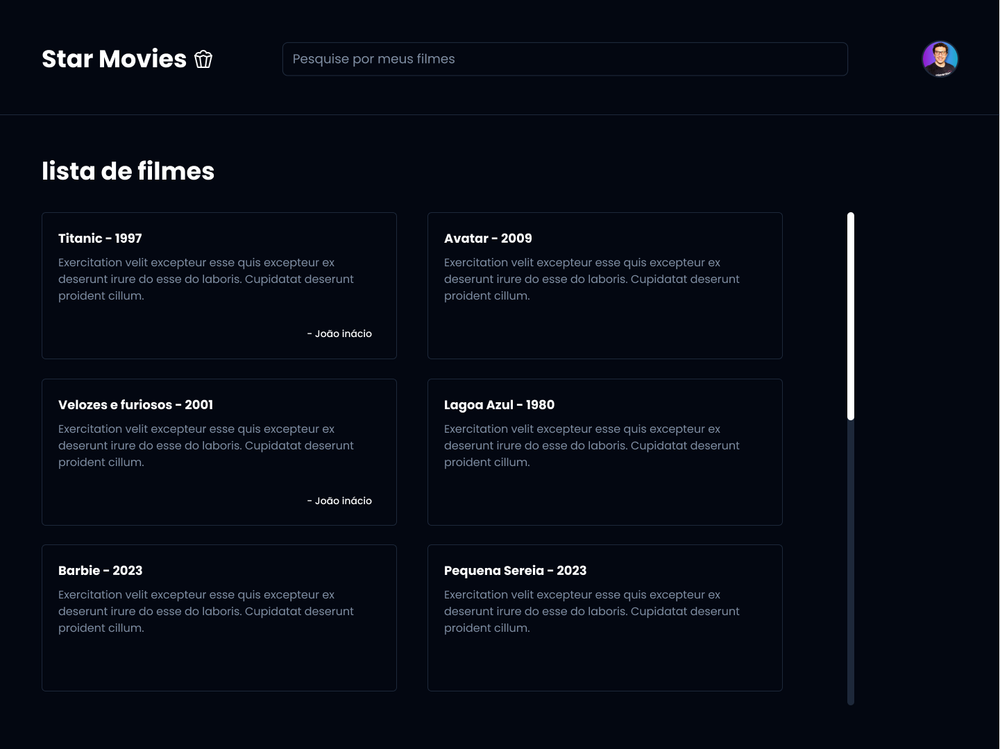

<!-- PROJECT LOGO -->
<br />
<div align="center">

  <h3 align="center">Star Movies</h3>

  <p align="center">
    Projeto desafio do evento de NodeJS feito com Rocketseat em parceria com a syngenta digital brasil.
    <br />
    ·
    <a href="https://www.figma.com/file/g7ohogoFBHO6ch8ghVzFgg/Star-Movies-%F0%9F%8D%BF-2.0?type=design&node-id=0-1&mode=design&t=okzvPwZm9Py3WYv2-0">Figma</a>
    ·
    <a href="https://syngentadigital.ag/">Syngenta Digital Brasil</a>
    ·
    <a href="https://www.rocketseat.com.br/">Rocketseat</a>
  </p>
</div>


<details>
  <ol>
    <li>
      <a href="#about-the-project">Sobre o projeto</a>
      <ul>
        <li><a href="#built-with">Feito por</a></li>
      </ul>
    </li>
    <li>
      <a href="#getting-started">Getting Started</a>
      <ul>
        <li><a href="#installation">Instalação</a></li>
      </ul>
    </li>
    <li><a href="#contributing">Contribua</a></li>
    <li><a href="#license">License</a></li>
    <li><a href="#Preview">Preview</a></li>
    <li><a href="#Contribuidores">Contribuidores</a></li>
  </ol>
</details>


## Sobre o Projeto

 

Star Movies é uma biblioteca de filmes onde os usuários podem criar e deletar filmes, atribuir notas e criar e deletar comentários. O objetivo do projeto é ser uma plataforma onde a comunidade possa se reunir para compartilhar seu amor por filmes e gerar interações entre os usuários.

### Funcionalidades

Crie, edite e delete filmes
Atribua notas a filmes
Crie e delete comentários
Visualize a lista dos filmes cadastrados

### Benefícios

Encontre novos filmes para assistir
Compartilhe sua paixão por filmes com outras pessoas
Interaja com outros usuários que gostam de filmes
Acompanhe seus filmes favoritos

### Tecnologias

[](https://vuejs.org/)
[](https://react.dev/)
[](https://tailwindcss.com/)

<p align="right">(<a href="#readme-top">back to top</a>)</p>


## Getting Started

Para executar o projeto, basta seguir os passos abaixo


### Installation

_Siga os passos a seguir para rodar o projeto localmente._

1. Get a free API Key at [https://example.com](https://example.com)
2. Clone the repo
   ```sh
   git clone https://github.com/gabrielSantos1101/Front-star-Movies.git

   ou

   gh repo clone gabrielSantos1101/Front-star-Movies
   ```
3. Install NPM packages
   ```sh
   npm install
   ```
4. No arquivo .env coloque seu ip local onde está rodando o servidor, como mostra o exemplo a baixo, ou deixe rodando diretamente no deploy `config.js`
   ```env
   local
   VITE_BASE_URL= 'http://localhost:8080'
   
   deploy
   VITE_BASE_URL= 'https://star-movie-api.onrender.com'
   ```
5. rode o projecto
   ```sh
   npm run dev
   ```

<p align="right">(<a href="#readme-top">back to top</a>)</p>


## Server

[Repo do back-End](https://github.com/EduardoNGomes/api-star-movie)


<p align="right">(<a href="#readme-top">back to top</a>)</p>


## Contribua

As contribuições são o que tornam a comunidade de código aberto um lugar tão incrível para aprender, inspirar e criar. Quaisquer contribuições que você fizer são muito apreciadas.

Se você tiver uma sugestão que melhoraria para o projeto  crie uma solicitação e mande uma PR. Você simplesmente abrir um problema com a tag "aprimoramento" e se possivel usar commits semanticos.
Não se esqueça de dar uma estrela ao projeto! Obrigado novamente!

1. Fork o Projecto (`https://github.com/gabrielSantos1101/Front-star-Movies.git`)
2. Create your Feature Branch (`git checkout -b dev`)
3. Commit your Changes (`git commit -m 'Add some AmazingFeature'`)
4. Push to the Branch (`git push origin dev`)
5. Open a Pull Request

<p align="right">(<a href="#readme-top">back to top</a>)</p>


## License

Distributed under the MIT License. See `LICENSE.txt` for more information.

<p align="right">(<a href="#readme-top">back to top</a>)</p>


## Preview

Project Link: [web-star-movies](https://web-star-movies.vercel.app/)

<p align="right">(<a href="#readme-top">back to top</a>)</p>


## Contribuidores

| Nome                                                                    | Papel               |
| ----------------------------------------------------------------------- | ------------------- |
| [Eduardo N Gomes](https://www.linkedin.com/in/eduardo-n-gomes/)         | Back-End / Front-End|
| [Gabriel Santos](https://www.linkedin.com/in/gabriel-santos-bb4a10188/) | Front-End \| Design |
| [Biro³](https://www.linkedin.com/in/birobirobiro/)                      | Design              |
| [Lara Azevedo](https://www.linkedin.com/in/larazevedoo/)                | Design              |

<p align="right">(<a href="#readme-top">back to top</a>)</p>
